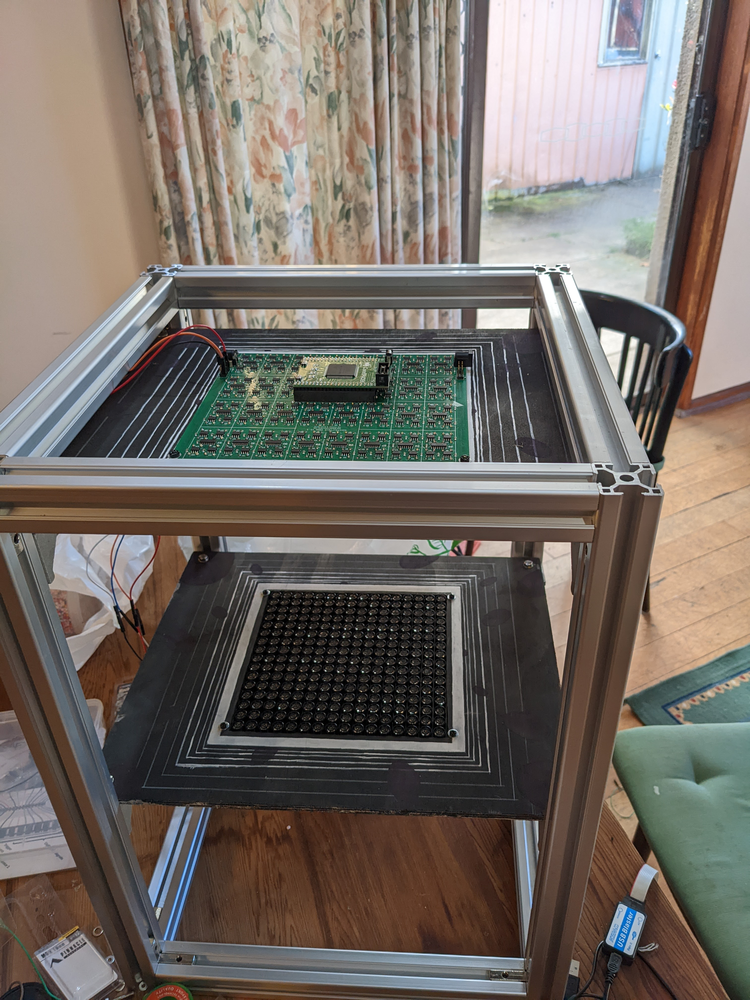
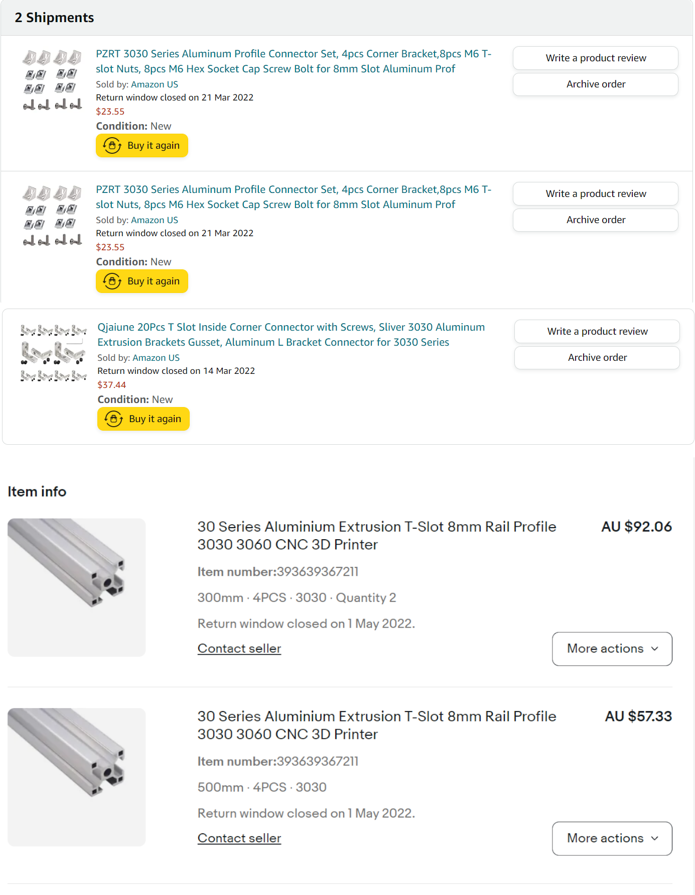

# Support Frame

The Upnalab repository includes a 3D printable frame. As an alternative I made a height adjustable aluminium T slot frame design similar to that which I saw in Upnalab videos and I guessed the sizes.

 This is my parts list.

I hand cut a plywood board to support the top and bottom arrays. In retrospect my design can be improved. I would laser cut the support boards because they need high precision.  I would use one size smaller T channel and reduce the cube size. 

Perhaps the best frame design I’ve seen is the laser cut frame by [dbeaven1](https://3dprintzothar.blogspot.com/2021/10/ghost-writing-halloween-project-using.html).
