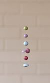

# The Midi Levitator
Controlling objects floating in space with music, using a MIDI interface.

In this [video](https://youtu.be/8fpSVYPssQY) I'm playing a tune to demonstrate the device in use.

 

A midi keyboard connected to [Ableton Live](https://en.wikipedia.org/wiki/Ableton_Live) outputs serial commands using [Max software](https://en.wikipedia.org/wiki/Max_(software)) to an ESP32 microcontroller that is controlling a [SonicSurface](https://github.com/upnalab/SonicSurface) acoustic levitator to float objects in space that respond to the keyboard.

To build the SonicSurface see the [Insructable](https://www.instructables.com/SonicSurface-Phased-array-for-Levitation-Mid-air-T/) and also take a look at my (JarrodTay) "I Made It" notes beneath the Instructable for issues that emerged during the build. 

# Contents of this Repository
- [ESP32Code](Firmware/ESP32%20controller) - Software to run on an ESP32 microcontroller that controls the [SonicSurface](https://github.com/upnalab/SonicSurface).
- [Max Software](MaxSoftware) - [Software](https://en.wikipedia.org/wiki/Max_(software)) that runs on [Ableton Live](https://en.wikipedia.org/wiki/Ableton_Live) which accepts midi input and sends commands via serial port to the ESP32.
- Project Report- [Generating a Dynamic Acoustic Levitation Display to
Create a Tool for Musicians](ProjectReport.pdf). 
- [Support Frame Design](Mech) - A different design to that in the Instructable.

